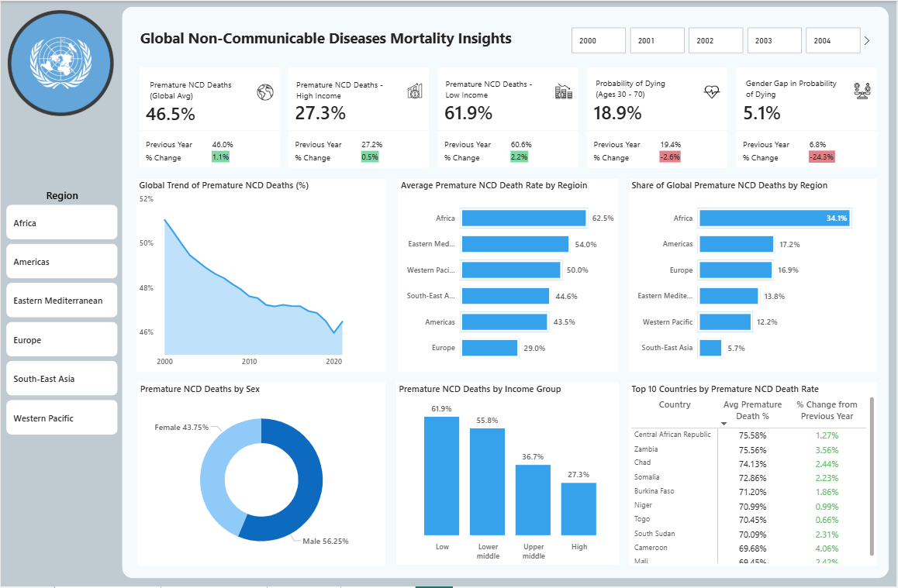

# Global Non-Communicable Diseases Mortality Insights

A Power BI dashboard analyzing premature NCD mortality (% of total NCD deaths) by income group, region, and gender — designed for public health insights.

---

## Project Overview

This project explores the burden of **non-communicable diseases (NCDs)** using official data from the **World Health Organization (WHO)**. The dashboard focuses on **premature deaths (before age 70)** due to NCDs, providing global insights across:

- World Bank income groups
- WHO-defined regions
- Gender (male vs female)

---

## Key Metrics

- **Premature NCD Deaths (Global Average)**
- **Premature NCD Deaths – High-Income Countries**
- **Premature NCD Deaths – Low-Income Countries**
- **Probability of Dying from NCDs (Ages 30–70)**
- **Gender Gap in Probability of Dying**

---

## Visuals Included

| Visual Type     | Description                                                      |
|-----------------|------------------------------------------------------------------|
| Line Chart      | Global Trend of Premature NCD Deaths (%)                        |
| Bar Chart       | Average Premature NCD Death Rate by Region                      |
| Bar Chart       | Share of Global Premature NCD Deaths by Region                  |
| Donut Chart     | Premature NCD Deaths by Sex                                     |
| Column Chart    | Premature NCD Deaths by Income Group                            |
| Table Chart     | Top 10 Countries by Premature NCD Death Rate                    |

---

## Data Source

- **Organization:** World Health Organization (WHO)
- **Dataset Theme:** Non-Communicable Diseases – Mortality
- **Access:** [WHO Global Health Observatory](https://www.who.int/data/gho)

---

## 🧰 Tools Used

- Power BI (Data Modeling, Visuals)
- DAX (Data Analysis Expressions)
- CSV datasets from WHO

---

## 💡 Key Insights

- Over **40%** of NCD related mortality occured before the age of 70.
- **Low-income countries** account for the highest burden of premature NCD deaths.
- Noticeable **gender and regional disparities** exist in NCD mortality patterns.
- Noticeable decline in the Global trend for premature NCD deaths.

---

## 📸 Dashboard Preview

---

